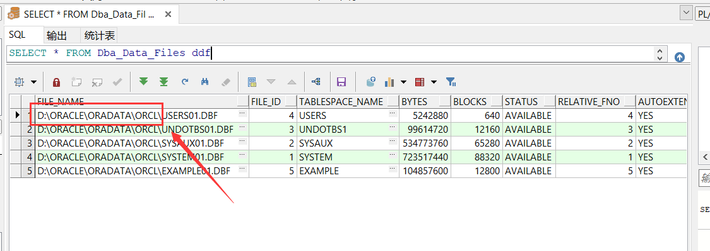

# ORACLE11g安装

## 1.下载解压

[ORACLE下载地址](https://www.oracle.com/database/technologies/oracle-database-software-downloads.html#19c "oracle")


**将两个压缩包解压并合在一起**

## 2. 关闭杀毒软件和防火墙


## 3. 安装


**点击setup.exe 会出现小黑窗口和以下界面**


**点击完成，等待安装**


**可点击此处解锁用户和设置密码**


**不设置的话（sys、system）默认为之前设置的口令**

***

## 4.PLSQL Developer安装

一直next

最后打开tool->Preferences做以下设置


**普通用户选normal 管理员选sysdba**


## 5.创建Oracle表空间

### a.查询表空间的存储目录 

```plsql
SELECT * FROM Dba_Data_Files ddf
```



### b.创建表空间：

```plsql
Create tablespace xxx
logging
datafile 'D:\ORACLE\ORADATA\ORCL\xxx.dbf'
size 50m
autoextend on
next 50m maxsize 2048m
extent management local;
```


### c.创建用户：

```plsql
Create user yyy identified by zzz default tablespace xxx temporary tablespace temp;
```

注意：以上yyy--创建的用户名，zzz--用户的密码，xxx为第1步创建的表空间名称

### d.为用户授权：

```plsql
grant connect,resource,dba to yyy;
```

**DBA: 拥有全部特权，是系统最高权限，只有DBA才可以创建数据库结构。
RESOURCE:拥有Resource权限的用户只可以创建实体，不可以创建数据库结构。
CONNECT:拥有Connect权限的用户只可以登录Oracle，不可以创建实体，不可以创建数据库结构。
对于普通用户：授予connect, resource权限。**